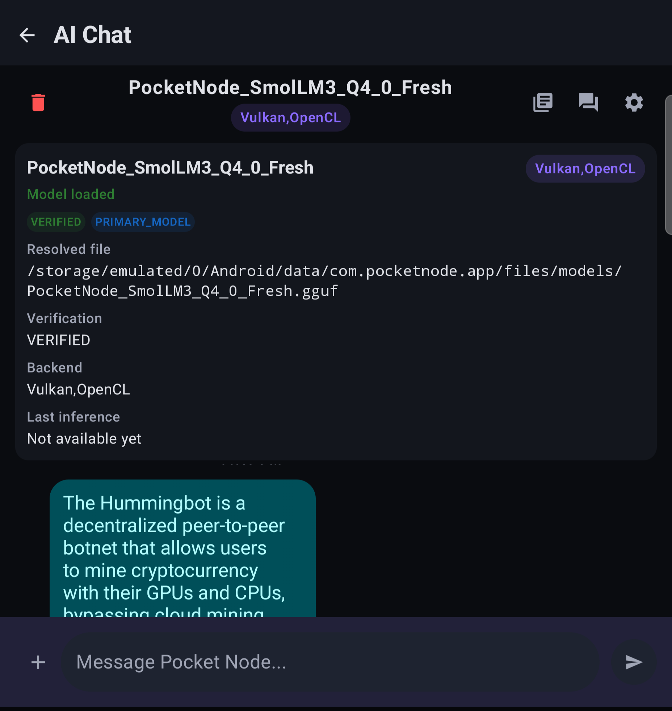
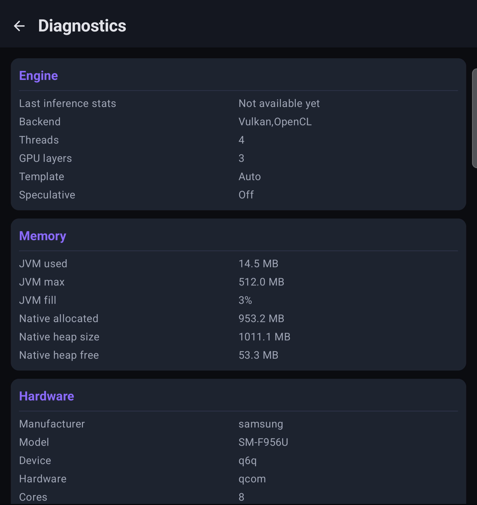
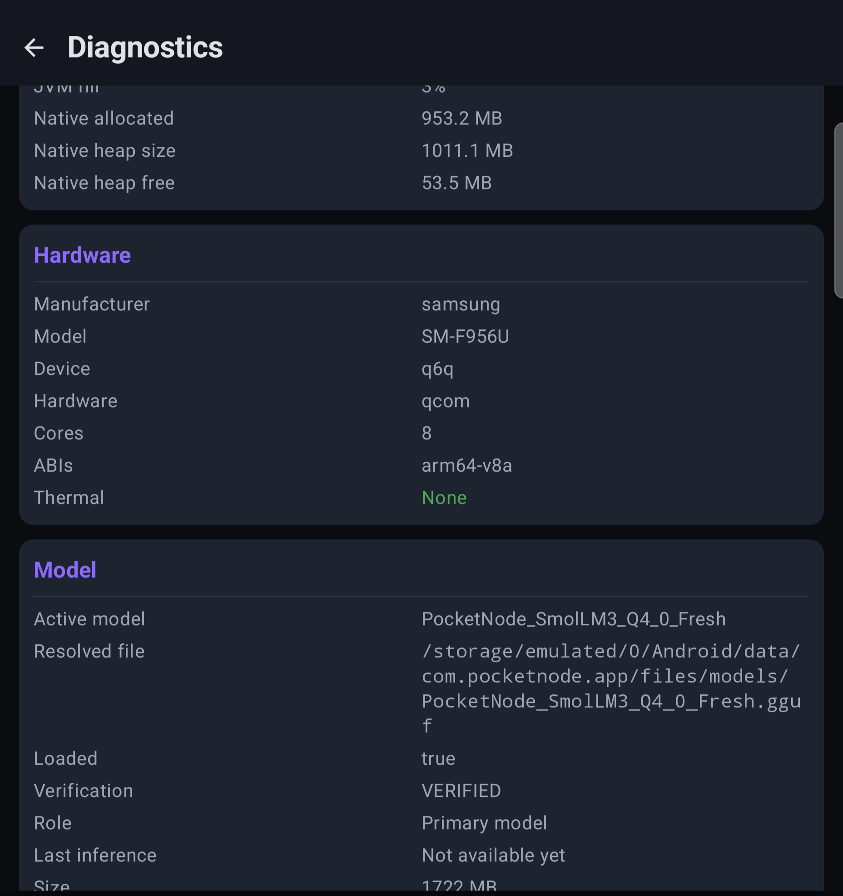
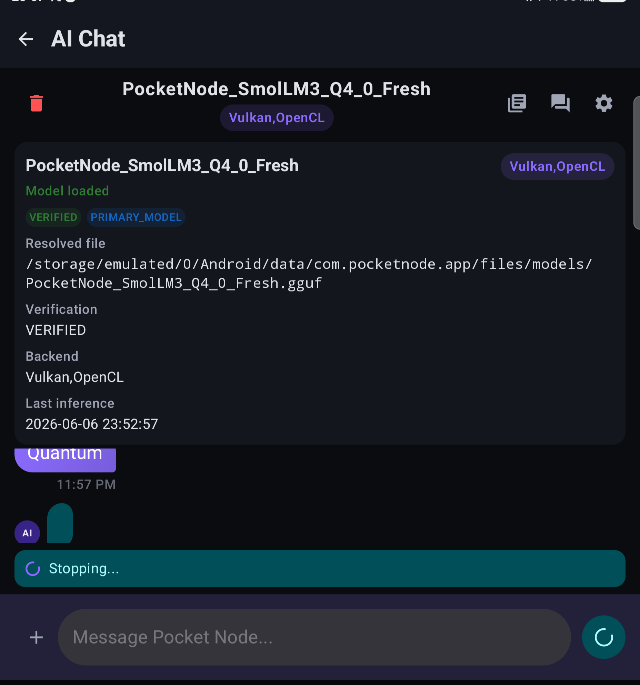

# Pocket Node for Android


A fully offline, privacy-first AI chat app for Android. Runs large language models **entirely on-device** using [llama.cpp](https://github.com/ggerganov/llama.cpp) — no data ever leaves your phone.

<div align="center">
  
  
  
  
</div>

---

## 📦 Download — v0.1.0-rc2 (Public Prerelease)

**[→ Download PocketNode-0.1.0-rc2-signed.apk](https://github.com/Zero-Cloud-Tax/pocket-node-releases/releases/tag/v0.1.0-rc2)**

This is a **free public prerelease**. Sideload only — not on the Play Store yet.

**SHA-256 verification:**
```
f1fe2887dd9f7ab0f9bd62021857bae0efdcb98c090b489a626b960154964126  PocketNode-0.1.0-rc2-signed.apk
```

**Install steps:**
1. Download the APK from the release page above.
2. On your Android device: Settings → Apps → Special app access → Install unknown apps → enable for your browser or file manager.
3. Open the APK and tap Install.

**Requirements:** Android 9.0+ (API 28), arm64-v8a device.

> **Note:** The auto-updater is disabled in RC2. Future releases require a manual reinstall.

> **Note:** Public Pro key issuance and payment are not open in RC2. The app includes the licensing framework, but key generation is not yet available.

---

## 🧠 Why Pocket Node?

Pocket Node turns your phone into a private AI computer:

- **No cloud**
- **No accounts**
- **No tracking**
- **No subscriptions**
- **No data leaving your device**

---

## ✨ What Works in RC2

| Feature | RC2 Status |
|---------|-----------|
| On-device LLM inference (llama.cpp) | ✅ Working |
| GGUF model import (file picker) | ✅ Working |
| Streaming token output | ✅ Working |
| Model Hub + curated downloads | ✅ Working |
| Vulkan & OpenCL GPU acceleration | ✅ Working |
| Edge API (OpenAI-compatible, port 11434) | ✅ Working |
| Multiple chat templates | ✅ Working |
| First-run device profiling | ✅ Working |
| Pro licensing (key validation) | ✅ Framework in place — key issuance not open yet |
| Document RAG (PDF/text) | 🔜 Not in RC2 |
| Vision / image input | 🔜 Not in RC2 |
| OTA auto-updater | 🔜 Not in RC2 |

---

## 🌐 Edge API

When Edge API is enabled in Settings, the app exposes an OpenAI-compatible endpoint on your local network:

```
POST http://<device-ip>:11434/v1/chat/completions
POST http://<device-ip>:11434/api/generate
GET  http://<device-ip>:11434/
```

Works with Continue.dev, Open WebUI, and any client that accepts an OpenAI-compatible base URL.

> ⚠️ The Edge API has **no authentication** in RC2. Only use it on a trusted LAN. Do not expose it to the internet.

---

## 📊 Benchmarks

*RC2 is tested and confirmed working on the Samsung Galaxy Z Fold 6. Numbers below are from earlier development on other devices and may not reflect current performance.*

### Galaxy Z Fold 6 (Snapdragon 8 Gen 3) — RC2 confirmed
- Llama 3.2 3B Q4_K_M → inference functional ✅

### Earlier reference numbers (not yet re-verified on RC2)

| Device | Model | Tokens/s |
|--------|-------|---------|
| Pixel 8 Pro (Tensor G3) | Phi-3.5-mini Q4_K_M | ~18 |
| Pixel 8 Pro (Tensor G3) | Llama-3.2-3B Q4_K_M | ~12 |
| Galaxy S24 Ultra (SD 8 Gen 3) | Phi-3.5-mini Q4_K_M | ~28 |
| Galaxy S24 Ultra (SD 8 Gen 3) | Mistral-7B Q4_K_M | ~9 |

---

## 🤖 Model Compatibility

| Model | Works? | Notes |
|-------|--------|-------|
| Phi-3.5-mini | ✔ | Fast, good reasoning |
| Llama-3.2-3B | ✔ | Best instruction following for the size |
| Mistral-7B | ✔ | High quality, needs 6GB+ RAM |
| Qwen2.5-7B | ⚠ | Slow on mid-range devices |
| LLaVA (vision) | 🔜 | Not supported in RC2 |

---

## 🛠️ Tech Stack

- **UI:** Kotlin + Jetpack Compose + Material 3
- **Inference:** JNI + C++ + llama.cpp (NDK, arm64-v8a)
- **Acceleration:** Vulkan compute + OpenCL (Adreno)
- **Local Storage:** Room DB + DataStore
- **Edge API:** Ktor CIO (port 11434)

---

## 🔒 Security Notes

- **No internet permission for core inference** — internet is only used for model downloads and the Edge API when enabled.
- **Network Security Config** blocks untrusted traffic.
- **Local-only Room DB** — chat history never syncs anywhere.
- **Zero analytics** — no Crashlytics, no trackers.

---

## 🚀 Roadmap

- [ ] Public Pro key issuance / payment flow
- [ ] RAG — PDF and text document Q&A
- [ ] Vision — image input (LLaVA-style)
- [ ] OTA auto-updater
- [ ] On-device quantization
- [ ] Chat export / import
- [ ] Play Store release

---

## 🔧 Troubleshooting

- **Model fails to load:** Ensure enough RAM is free. Try a smaller model (Q4_K_M 3B or less).
- **App crashes on startup:** Grant storage permissions (Android 13+).
- **Vulkan not supported:** App falls back to CPU automatically. Performance will be lower.
- **Out of memory on 7B models:** 7B models need ~8GB physical RAM.
- **NDK not found (building from source):** Install NDK r26+ via Android Studio SDK Manager.

---

## 🏗️ Building from Source

### Requirements
- Android Studio Ladybug (2024.2+) or newer
- Android NDK r26+ and CMake 3.22.1+
- Min SDK: Android 9.0 (API 28)
- Set env vars before building release: `POCKETNODE_PRO_HMAC_SECRET`, `POCKETNODE_PURCHASE_URL`, `POCKETNODE_OPERATOR_URL`

### Steps
1. `git clone <repo-url> "Pocket Node" && cd "Pocket Node"`
2. Open in Android Studio.
3. SDK Tools → ensure NDK and CMake are installed.
4. `./gradlew assembleDebug` — first build takes ~5 min (compiles llama.cpp).

---

## 🤝 Contributing

Pull requests are welcome. For major changes, open an issue first.

## 📜 License

MIT — see individual dependencies for their licenses. llama.cpp is licensed under MIT.
